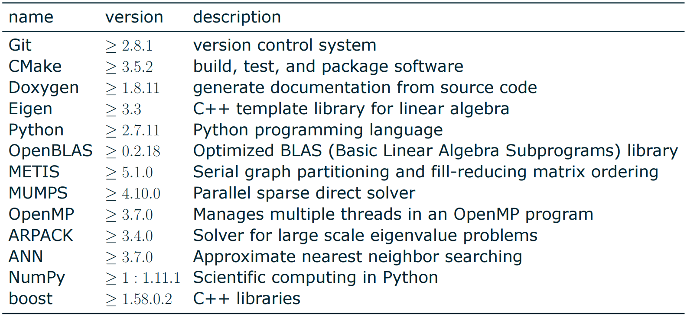
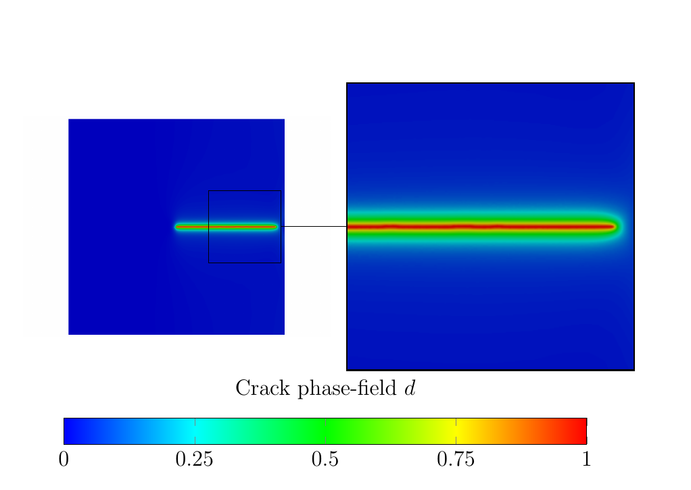

What is it?
===========
A finite element library.

How do I install it?
====================
At your own peril.

First, you need some external dependencies

    sudo apt-get install git swig3.0 cmake doxygen python-dev python-numpy python-instant\
    libboost-all-dev libeigen3-dev libopenblas-dev libmetis-dev libmumps-seq-dev libann-dev libarpack2-dev libomp-dev

Then, you need to check out the source code

    git clone https://github.com/nutofem/nuto.git

Create a build directory and switch to it

    mkdir nuto/build && cd nuto/build

Run cmake

    cmake ..

Once this ran without errors, you can issue make (`-j4` for parallel building)

    make -j4

If you want to use the python module, and run all the tests, you need to add 
the module path to your environment

    export PYTHONPATH=<path/to/nuto/build>:$PYTHONPATH

In the end, run the test suite to see if all went well

    make test

Requirements
============

Examples
========

Can I see some code?
====================

Sure, take a look at [our documentation](https://nutofem.github.io/nuto/).
